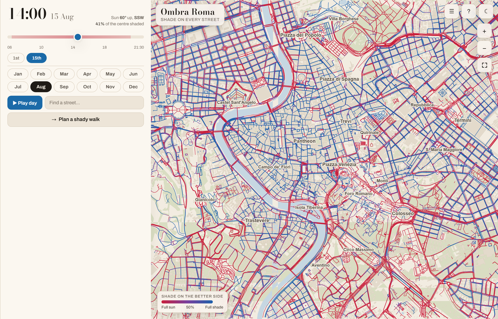

# Ombra Roma

A street-by-street shade map of central Rome, and walking routes that prefer the
shady side. One self-contained HTML file — no server, works offline.

Blue is shaded, red is open sun. Scrub the time and date; tap any street to
see its whole day; give it two endpoints and it will trade a short detour for a
lot less sun.



## Build

```bash
pip install -r requirements.txt
npm install
npx playwright install chromium webkit    # both; make test needs WebKit too
make            # ~10 min; the OSM and elevation data is already cached in data/
make test
open dist/ombra-roma.html
```

`make distclean` also drops the cached downloads — only do that if you mean it,
as re-fetching from public Overpass mirrors takes about an hour.

## What it actually computes

Real building footprints from OpenStreetMap, heights from OSM tags and the
Italian cadastre, real tree canopy, real terrain, and NOAA solar geometry. Rays
are cast from both pavements of every street at 768 sun positions; the number
you see assumes you walk on the shadier side. Rome's hills shadow each other, so
Trastevere goes dark under the Janiculum in the early evening and the Tiber
bridges lose the sun well before the open city does.

Sanity check: at 2 pm on 15 August, Via dei Fori Imperiali is 0 % shaded and Via
dei Coronari is 93 %. That is the right answer for both.

See `CLAUDE.md` for the pipeline, the measured accuracy, and the things that will
bite you.

## Licence / attribution

Map data © OpenStreetMap contributors, ODbL. Building heights also from
[EUBUCCO](https://eubucco.com/) v0.2 (ODbL), whose Lazio rows come from the
Italian cadastre. Elevation data courtesy of the USGS/NASA SRTM programme via
AWS Open Data.
